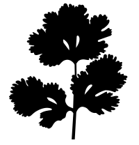

parsley
====
Minimal parser generator producing [BDE attribute types][bdlat]

Why
---
Tiny domain specific languages sometimes find their way into C++ code. An
ideal way to parse these languages in C++ is to use [boost.spirit][spirit].
However, sometimes the full glory of Spirit is more or less than you need.
Spirit is powerful and general, but you have to tell it how to marshal into
the types that make up the parse tree, or otherwise (preferrably) have to
use [boost.fusion][fusion].

Instead, let's leave boost aside. Say you want to parse a path-like language:

    foo/bar/last(baz, "the \"buzz\"")/value[5]

First, write a grammar:

    Path  ::=  terms:Term ("/" terms:Term)*
    
    Term  ::=  identifier:IDENTIFIER
           |   wildcard:"*"
           |   function:Function
           |   selection:Selection
    
    Function  ::=  
        name:IDENTIFIER 
        "(" (args:Argument (SEPARATOR args:Argument)*)? ")"
    
    Argument  ::= identifier:IDENTIFIER
               |  stringLiteral:STRING
               |  integer:INTEGER
    
    Selection  ::=  array:IDENTIFIER "[" index:INTEGER "]"

    IDENTIFIER  ::=  /[a-zA-Z_][0-9a-zA-Z_]*/

    INTEGER  ::=  /0|[1-9][0-9]*/

    STRING  ::=  /"([^\\]|\\.)*"/

    SEPARATOR  ::=  /\s*,\s*/

Then, run `parsley`. It will produce a schema describing a parse tree:
```xml
<schema xmlns="http://www.w3.org/2001/XMLSchema"
        targetNamespace="http://www.w3.org/2001/XMLSchema">

  <complexType name="Path">
    <sequence>
      <element name="terms" type="Term" minOccurs="1" maxOccurs="unbounded"/>
    </sequence>
  </complexType>
  
  <complexType name="Term">
    <choice>
      <element name="identifier" type="string"/>
      <element name="wildcard"   type="string"/>
      <element name="function"   type="Function"/>
      <element name="selection"  type="Selection"/>
    </choice>
  </complexType>
  
  <complexType name="Function">
    <sequence>
      <element name="name" type="string"/>
      <element name="args" type="Argument" 
               minOccurs="0" maxOccurs="unbounded"/>
    </sequence>
  </complexType>
  
  <complexType name="Argument">
    <sequence>
      <element name="identifier"    type="string"/>
      <element name="stringLiteral" type="string"/>
      <element name="integer"       type="string"/>
    </sequence>
  </complexType>
  
  <complexType name="Selection">
    <sequence>
      <element name="array" type="string"/>
      <element name="index" type="string"/>
    </sequence>
  </complexType>

</schema>
```
`parsley` will also generate a BDE-style utility component that parses UTF-8
text into the types in the schema, according to the rules in the grammar:
```c++
// ...

struct ParserUtil {

    static int parse(Path                     *output,
                     const bslstl::StringRef&  input,
                     bsl::ostream&             errors);

    static int parse(Term                     *output,
                     const bslstl::StringRef&  input,
                     bsl::ostream&             errors);

    // ...
};

// ...
```
The parser utility assumes that the parse tree types were translated into C++
classes using a separate code generator.

What
----
`parsley` is a [Racket][racket] [package][package] and [raco][raco] command
that generates a schema and an [LL][ll] recursive descent parser when given
a [PEG][peg]-like description of a grammar. The grammar must avoid [left
recursion][left-recursion].

How
---
TODO: Invocation, options, etc.

More
----
### The Grammer Description Language
TODO: Write a guide.

For fun, here's the grammar description language expressed in itself:

    Grammar  ::=  WS_LEFT? rules:Rule (BLANK_LINE rules:Rule)*) WS_END?

    Rule  ::=  ignore:"ignore"? name:IDENTIFIER ("::="|":") pattern:Pattern

    Pattern  ::=  alternation:Alternation     (* one from multiple options *)
              |   concatenation:Concatenation (* one or more subpatterns *)

    Alternation  ::=  patterns:PatternTerm ("|" patterns:PatternTerm)+

    Concatenation  ::=  patterns:PatternTerm+

    PatternTerm  ::=  bound:BoundPatternTerm
                  |   unbound:QuantifiedPatternTerm

    BoundPatternTerm  ::=  name:IDENTIFIER ":" term:QuantifiedPatternTerm

    QuantifiedPatternTerm  ::=  star:UnquantifiedPatternTerm "*"
                            |   plus:UnquantifiedPatternTerm "+"
                            |   question:UnquantifiedPatternTerm "?"
                            |   term:UnquantifiedPatternTerm

    UnquantifiedPatternTerm  ::=  literal:STRING
                              |   regex:REGEX
                              |   rule:IDENTIFIER
                              |   empty:EMPTY
                              |   "(" pattern:Pattern ")"

    IDENTIFIER  ::=  /[a-zA-Z_][0-9a-zA-Z_]*/      (* e.g. foo5 but not 5foo *)

    STRING  ::=  /"([^\\"]|\\.)*"/                 (* e.g. "\"with\" escape" *)

    REGEX  ::=  /\/([^\\\/]|\\.)*\//               (* e.g. /foo|ba[rz]/ *)

    EMPTY  ::=  /\(\)/                             (* () matches nothing *)

    ignore COMMENT  ::=  /\(\*([^*]|\*[^)])*\*\)/  (* e.g. this comment *)

    (* We want to simulataneously treat a blank line as a rule delimiter, but
       also otherwise ignore whitespace. To do that, stretches of whitespace
       have to be categorized by their adjacency to non-whitespace. *)

    BLANK_LINE  ::=  /\n[ \t]*\n/

    WS_LEFT  ::=  /\s+(?=\S)/

    WS_END  ::=  /\s+$/

    ignore WS_BETWEEN  ::=  /(?<=\S)\s+(?=\S)/

[bdlat]: https://bloomberg.github.io/bde/group__bdlat.html
[spirit]: http://boost-spirit.com/home/
[fusion]: https://www.boost.org/doc/libs/1_68_0/libs/fusion/doc/html/
[racket]: https://racket-lang.org/
[package]: https://docs.racket-lang.org/pkg/Package_Concepts.html
[raco]: https://docs.racket-lang.org/raco/
[ll]: https://en.wikipedia.org/wiki/LL_parser
[peg]: https://en.wikipedia.org/wiki/Parsing_expression_grammar
[left-recursion]: https://en.wikipedia.org/wiki/Left_recursion